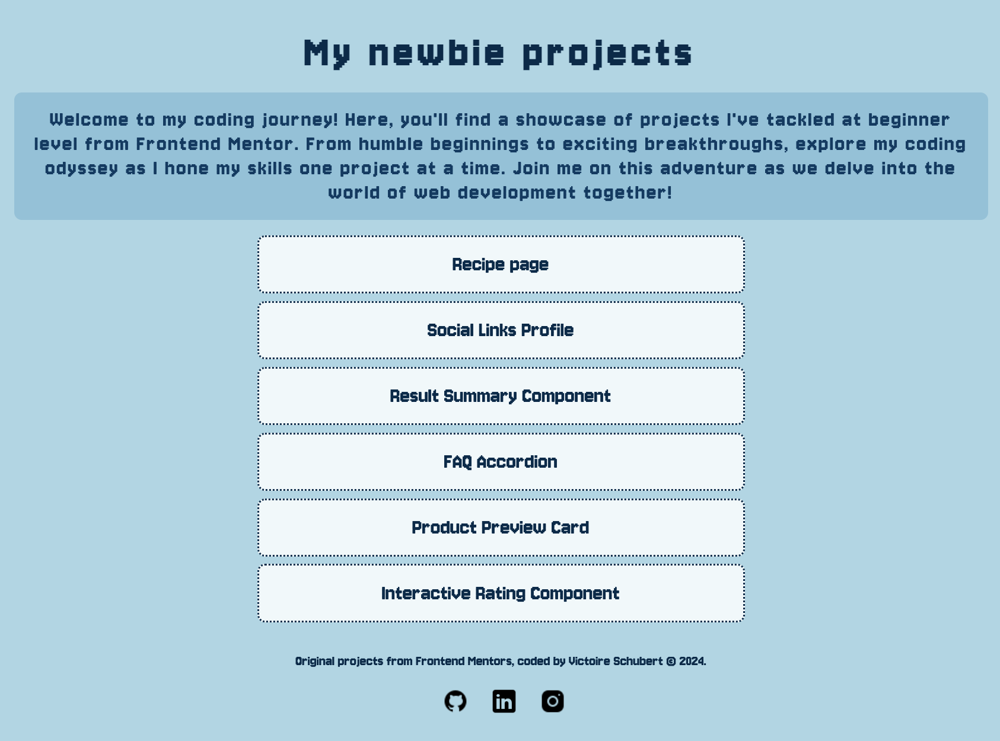

# Frontend Mentor - Newbie Projects

This is a website grouping the solutions to the [newbie level Frontend Mentor challenges](https://www.frontendmentor.io/challenges?difficulty=1&type=free). Frontend Mentor challenges help you improve your coding skills by building realistic projects.

## Table of contents

- [Overview](#overview)
  - [Screenshot](#screenshot)
  - [Links](#links)
- [Author](#author)

## Overview

### The challenge

### Screenshot

<!--
### Links

- Live Site URL: [Add live site URL here](https://your-live-site-url.com) -->

## Author

- Frontend Mentor - [@VicSchbt](https://www.frontendmentor.io/profile/VicSchbt)
- LinkedIn - [Victoire Schubert](www.linkedin.com/in/victoire-schubert)
- Instagram - [@vicschbt.codes](https://www.instagram.com/vicschbt.codes?igsh=OHczMzcwMWpjZm1p&utm_source=qr)
