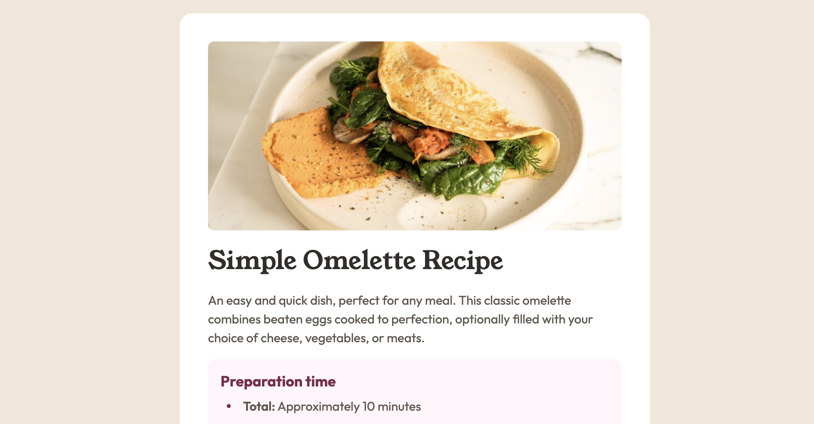

# Frontend Mentor - Recipe page solution

This is a solution to the [Recipe page challenge on Frontend Mentor](https://www.frontendmentor.io/challenges/recipe-page-KiTsR8QQKm). Frontend Mentor challenges help you improve your coding skills by building realistic projects.

## Table of contents

- [Overview](#overview)
  - [The challenge](#the-challenge)
  - [Screenshot](#screenshot)
  - [Links](#links)
- [My process](#my-process)
  - [Built with](#built-with)
  - [What I learned](#what-i-learned)
  - [Useful resources](#useful-resources)
- [Author](#author)

## Overview

### Screenshot



### Links

- Solution URL: [My solution](https://www.frontendmentor.io/solutions/recipe-page-vanilla-js-8B6GDTtf_Z)
- Live Site URL: [Get the omelette recipe here](https://vicschbt.github.io/PERSO-newbie-projects/projects/recipe-page/index.html)

## My process

### Built with

- Semantic HTML5 markup
- SCSS
- Flexbox
- Mobile-first workflow

### What I learned

The point of the mini-project was to work with different type of list. And for both of them there was some custom style on the marker. The most interesting part was learning that it is possible to use a custom counter for an `ol` list.

```scss
&-instructions__list {
	counter-reset: cpt;
	list-style: none;
	li {
		counter-increment: cpt;
		display: flex;
		gap: $gap;
		&::before {
			content: counter(cpt) '.';
			font-size: 1rem;
			font-weight: 600;
			color: $nutmeg;
		}
	}
}
```

### Useful resources

- [Codepen from Richard](https://codepen.io/rnbutler87/pen/BEQKvP) - This helped me for the customization of the bullet point, to get the correct alignment and also the correct style.

## Author

- Frontend Mentor - [@VicSchbt](https://www.frontendmentor.io/profile/VicSchbt)
- LinkedIn - [Victoire Schubert](www.linkedin.com/in/victoire-schubert)
- Instagram - [@vicschbt.codes](https://www.instagram.com/vicschbt.codes?igsh=OHczMzcwMWpjZm1p&utm_source=qr)
